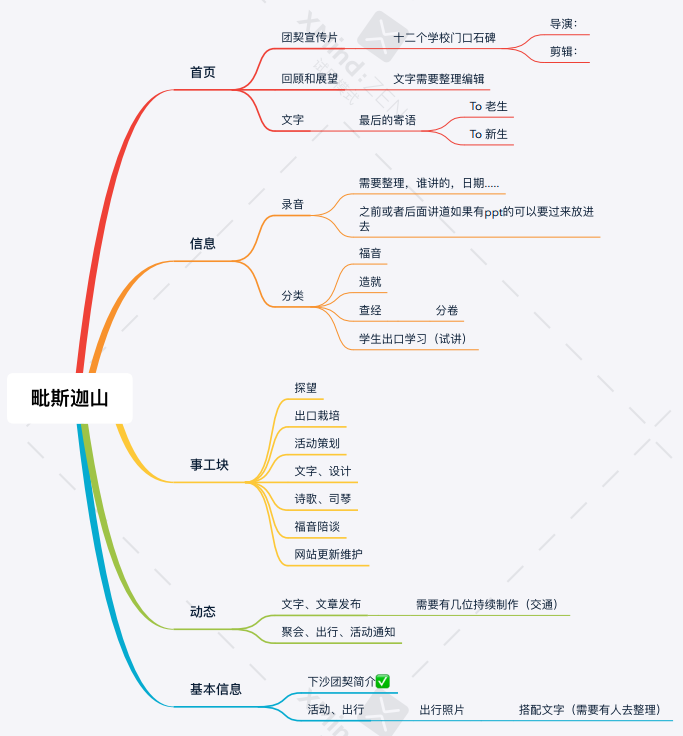

# Mount Pisgah
> 做挖井人，得活水井

## 1. 主要内容
- 团契简介
- 团契信息
- 团契动态
- 团契事工




## 2. 解决方案
1. 代码管理（git）
2. 前端（vue.js + vuetify）
3. 后端（Express.js/SpringBoot）
4. 数据库（MongoDB/其他）
5. 音视频存储（AWS S3/Google Cloud Storage/Azure Blob Storage）

## 3. 项目启动
1. 拉取项目代码
```shell
git clone https://github.com/Takohubuki/MountPisgah-frontend.git
```

2. 安装nodejs

3. 安装依赖环境
```shell
// 进入项目文件夹运行以下命令
npm install
```

4. 运行
```shell
npm run dev
```